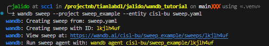

# `wandb` in the cluster
This is a tutorial/template for Boston University researchers who have SCC projects to integrate [`wandb`](https://wandb.ai/site) in their ML stack with the [Boston University Shared Computing Cluster (SCC)](https://www.bu.edu/tech/support/research/computing-resources/scc/), the batch system of which is based on the [Sun Grid Engine](https://gridscheduler.sourceforge.net/) (SGE) scheduler. Therefore, this is more a tutorial/example for wandb + SCC integration, rather than a tutorial on `wandb` -- you can find the latter in abundance online.

## Installing `wandb` and others
First begin by creating a virtual environment for your project in your project folder. In the terminal on the SCC login node, navigate to the top level of your project folder and proceed with
```
module load python3/3.10.12
```
which is the latest version of python available on the SCC (you can check with `module avail python`).
After this, you can now create a python virtual environment with 
```
virtualenv .venv
```
This creates a virtual environment, the data and installations for which are stored in the folder `.venv`. To activate the environmnent,
```
source .venv/bin/activate
```

Now we can start installing `wandb` and other necessary packages in your virtual environment on the SCC with 

```
pip install -r requirements.txt
```

Then login to your `wandb` account using
```
wandb login
```
which will prompt you for your API key. If you don't have an API key, you may log on [here](https://wandb.ai/authorize) to retrieve it. When you paste it in the terminal, it won't show anything -- that's ok, it's for security.

You should be good to run this command just once during installation. Any other time you log on the SCC, you wouldn't need to log into `wandb` again because it created a `.netrc` file with your `wandb` login credentials in your home directory.

## Basic `wandb`
I provided a basic sample of how to use the basic features of `wandb`, which are `wandb.log` and `wandb.watch` in `basic_train.py`. This allows you to monitor training, and even visualize the tensors themselves as the evolve throughout training! It is all there in `basic_train.py`.

You may define the project name and entity (entity is either the `wandb` team name which is `cisl-bu`, or your `wandb` username) in the config `dict` in `basic_train.py`
Without the `entity` field, it will default to your wandb `username` and without the `project` field, it will default to "Uncategorized." 

If you wish to run a more serious/heavy experiment on an SCC compute node `run.qsub` is the qsub file you may run with 
```
qsub run.qsub
```
otherwise you will be process-reaped by running it in the SCC login node.

Modify the paths, and requested resources accordingly. `qsub` options for requesting resources and batch scripts examples may be found [here](https://www.bu.edu/tech/support/research/system-usage/running-jobs/submitting-jobs/).

## Hyperparameter search: `wandb.sweep`
I provided a simple template for running hyperparameter search on batch jobs on the SCC, the relevant files are `sweep.yaml`, `sweep.qsub`, `sweep.sh` and `sweep_train.py`. 

First, define your configuration parameters in `sweep.yaml`. Information on the structure of the file can be found [here](https://docs.wandb.ai/guides/sweeps/define-sweep-configuration). You may then instantiate a `sweep` in the CLI with
```
wandb sweep --project <project_name> --entity <entity_name> sweep.yaml
```
which will print out the `sweep_id` you need to run the hyperparameter search. It looks like this:


You'll then take the given command, `wandb agent cisl-bu/sweep_example/lkjlh4uf` in this example, and copy it into the last line of `sweep.qsub` but add the option `--count 1`, to make sure that that batch job runs only one run to ensure that all jobs can complete within the time limit defined by `h_rt`.

The `qsub` script looks like this
```
#!/bin/bash -l

#$ -P tianlabdl

#$ -l h_rt=1:00:00

# array jobs to define number of nodes/sweep agents to use on the SCC
#$ -t 1-20

module load python3/3.10.12
source activate .venv/bin/activate
wandb agent --count 1 cisl-bu/sweep_tutorial/lkjlh4uf
```
We first define our SCC project, the job time limit, `N` SCC compute nodes to use (how many agents to run) from `1-N`. Then we just load the python module, activate the virtual environment and call the agent for that sweep_id! 

If you need a GPU, you may request one (or several). An example is shown here that you can add to the qsub script before the linux commands:
```
#$ -l gpus=1
#$ -l gpu_c=8.0
#$ -l gpu_memory=48G
```
BU SCC SGE documentation for GPU computing is [here](https://www.bu.edu/tech/support/research/software-and-programming/programming/multiprocessor/gpu-computing/).

You can also request a number of CPU cores with
```
#$ -pe omp 8
#$ -l mem_per_core=8G
```
up to 32 cores, and from 3 to 28 gigabytes of memory per core.

The example qsub script would then look like this:
```
#!/bin/bash -l

# Set SCC project
#$ -P tianlabdl

#$ -l h_rt=12:00:00

#$ -pe omp 8
#$ -l mem_per_core=8G
#$ -t 1-20

#$ -l gpus=1
#$ -l gpu_c=8.0
#$ -l gpu_memory=48G

module load python3/3.10.12
source activate .venv/bin/activate
wandb agent --count 1 cisl-bu/sbr_diffusion/lkjlh4uf
```

I wrote a shell script `sweep.sh` which is a wrapper for the qsub batch script that you will ultimately run in the login node by entering in the terminal:
```
./sweep.sh
```

If this doesn't work, you'll have to change the access permissions with
```
chmod +x ./sweep.sh
```
and then run `./sweep.sh` again.

You never need to track which hyperparameter combinations you're doing; the Sweep Controller on the wandb backend takes care of all that for you, that you can call the this qsub script several times without changing the files!

You can monitor the array batch job with `qstat -u <scc username>` and if you want to watch the status,
```
watch -n 1 "qstat -u <scc username>"
```

The wandb sweep controller runs until you stop it which you can do on the wandb.ai sweeps project webpage, or in the terminal with the command
```
wandb sweep --cancel cisl-bu/sweep_example/lkjlh4uf
```
for example.

If you decide to stop the runs, you may either cancel the sweep like above or with the batch system command 
```
qdel <JOBID>
```


`wandb.sweep` is very flexible, you may search over more parameters than typical ML hyperparameters. Get creative! But also be wary that  larger number of parameters to search over will require more runs, which could take a while on the SCC since we have a limited number of GPUs (for now).

Otherwise, happy ML training!
## Contributions
This repo is by no means a complete tutorial. What I have currently is just a fraction of wandb capabilities. If you're enjoying another wandb feature, I encourage you to make a PR for this repo with your own tutorial! And if there are any errors/mistakes/questions/comments, please let me know at jalido@bu.edu :)
