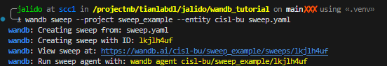

# `wandb` on the SCC

This is a tutorial/template for Boston University researchers with SCC projects who want to integrate [`wandb`](https://wandb.ai/site) into their ML stack on the [Boston University Shared Computing Cluster (SCC)](https://www.bu.edu/tech/support/research/computing-resources/scc/). The SCC's batch system is based on the [Sun Grid Engine](https://gridscheduler.sourceforge.net/) (SGE) scheduler.

You can use wandb on a personal workstation, but its benefits really shine in a cluster setting — particularly `wandb sweep` combined with SGE array jobs, which gives you distributed experimentation and tracking with very little bookkeeping on your end. So this is a tutorial on wandb + SCC integration rather than a tutorial on wandb itself; you can find the latter in abundance online.

## Installing `wandb` and other dependencies

Begin by cloning this repository into your SCC project folder. Once you've SSH'ed into the SCC login node, navigate to the folder where you want the repository and run:

```bash
git clone https://github.com/bu-cisl/wandb_tutorial.git
```

Now create a virtual environment inside the repo. `cd` into it and load Python:

```bash
module load python3/3.10.12
```

This is a recent version of Python on the SCC — check what's currently available with `module avail python`.

Create the virtual environment:

```bash
virtualenv .venv
```

This stores the environment's data and installations in a folder called `.venv`. Activate it with:

```bash
source .venv/bin/activate
```

Now install `wandb` and the other required packages (`torch`, `torchvision`, `wandb`):

```bash
pip install -r requirements.txt
```

Then log in to your wandb account:

```bash
wandb login
```

This prompts you for your API key. If you don't have one, you can retrieve it [here](https://wandb.ai/authorize). When you paste it into the terminal nothing will appear — that's expected, it's a security feature.

You only need to run `wandb login` once. It writes a `.netrc` file containing your credentials to your home directory, so future sessions won't ask again.

> **Every new session, though, you do need to re-run these two lines from the repo directory:**
> ```bash
> module load python3/3.10.12
> source .venv/bin/activate
> ```
> The loaded module and the activated environment live in your shell and disappear when you log out. Without them, `wandb` isn't on your `PATH` and you'll get `wandb: command not found`. This is also why every qsub script below starts with the same two lines — compute nodes get a fresh shell too.

### Before you submit anything: edit these

The batch scripts ship with placeholders that **will fail until you fill them in**:

| File | What to set |
| --- | --- |
| `run.qsub` | `#$ -P <your_project>` — your SCC project name |
| `sweep.qsub` | `#$ -P <your_project>` — your SCC project name |
| `sweep.qsub` | the `wandb agent ...` line — your own sweep ID (see below) |
| `basic_train.py` | `"entity"` — your wandb username, unless you're on the `cisl-bu` team |

You can find your project name with `groups` on the login node, or on the [SCC project page](https://www.bu.edu/tech/support/research/system-usage/get-started/).

Job output is written to `logs/` inside the repo. `sweep.sh` creates that directory for you; if you submit `run.qsub` directly with `qsub`, run `mkdir -p logs` first, since SGE will reject the job if it can't write the output file.

### Cache and staging directories

wandb writes two things to your home directory that can grow quickly and push you past the SCC's 10GB home quota:

- `~/.local/share/wandb` — staging for artifacts being uploaded
- `~/.cache/wandb` — the local artifact cache

This matters here in particular: `basic_train.py` logs a model artifact at the end of every epoch, so these directories fill up faster than you'd expect.

Redirect both by adding these lines to your `.bashrc` or `.zshrc` (whichever shell you use):

```bash
export WANDB_DATA_DIR=/projectnb/<your_project>/$USER/wandb/data
export WANDB_CACHE_DIR=/projectnb/<your_project>/$USER/wandb/cache
```

Create the directories once with `mkdir -p`, and substitute your actual project name.

You can also point these at [`/scratch`](https://www.bu.edu/tech/support/research/system-usage/running-jobs/resources-jobs/#scratch), which is fast local storage on the compute node. Just be aware that `/scratch` is node-local — a job on a different node won't see what a previous job wrote — and its contents are deleted after 31 days and never backed up. It's a good fit for pure scratch traffic, less so for anything you might want to re-download later. If you go that route, use a path you own, e.g. `/scratch/$USER/wandb`.

(Discussion of the original problem on the [wandb forums](https://community.wandb.ai/t/wandb-artifact-cache-directory-fills-up-the-home-directory/5224).)

## Basic `wandb`

`basic_train.py` trains a small CNN on MNIST and demonstrates the core features: `wandb.log()` and `wandb.watch()`. Together these let you monitor training and even visualize the tensors themselves as they evolve over the course of a run — the script logs feature-map images every couple of epochs, along with the model as a versioned artifact.

You can set the project name and entity in the `config` dict at the top of the file. The entity is either your wandb team name (`cisl-bu` for us) or your wandb username. Without an `entity` field it defaults to your username; without a `project` field it defaults to "Uncategorized." Note that the script currently hardcodes `cisl-bu`, which will fail if you're not on that team.

MNIST downloads automatically into `data/` on first run.

For anything heavier than a quick test, submit it to a compute node rather than running it on the login node, where the resource limits will kill your process:

```bash
qsub run.qsub
```

`run.qsub` requests a 12-hour limit and a single GPU with a compute capability of at least 3.5. Adjust the paths and requested resources to match your setup. Options for requesting resources, along with example batch scripts, are documented [here](https://www.bu.edu/tech/support/research/system-usage/running-jobs/submitting-jobs/). There's more on qsub scripts in the next section.

## Hyperparameter search: `wandb sweep`

wandb's [sweep](https://docs.wandb.ai/guides/sweeps) functionality makes experimentation organized and easy. You write a configuration file describing the parameter space, and a Sweep Controller on the wandb backend handles the bookkeeping. From your side, you just launch Sweep Agents pointed at the same sweep ID — you never have to think about which parameter combination each agent is running.

The relevant files here are `sweep.yaml`, `sweep.qsub`, `sweep.sh`, and `sweep_train.py`.

First, define your search space in `sweep.yaml`. The shipped example searches `learning_rate` and `batch_size` with random search, minimizing `loss`. The file format is documented [here](https://docs.wandb.ai/guides/sweeps/define-sweep-configuration); valid values for `method` are `grid`, `random`, and `bayes`.

Then create the sweep from the login node. Remember to load your environment first if you're in a fresh session:

```bash
module load python3/3.10.12
source .venv/bin/activate

wandb sweep --project <project_name> --entity <entity_name> sweep.yaml
```

This prints the sweep ID you'll need, along with a ready-made `wandb agent` command. It looks like this:



Take that agent command — `wandb agent cisl-bu/sweep_example/lkjlh4uf` in this example — and put it in the last line of `sweep.qsub`, adding the `--count 1` option. That limits each batch job to a single run, which keeps every job comfortably inside the wall-clock limit set by `h_rt`. The script uses SGE's `-t` flag to submit an array job, so you get many tasks each running one agent.

The `qsub` script looks like this:

```bash
#!/bin/bash -l

# Set your SCC project
#$ -P <your_project>

#$ -l h_rt=1:00:00

# merge stderr into stdout
#$ -j y

# array job: 20 tasks, each running one sweep agent
#$ -t 1-20

module load python3/3.10.12
source .venv/bin/activate

# replace with the sweep ID printed by `wandb sweep`
wandb agent --count 1 cisl-bu/sweep_example/lkjlh4uf
```

We set the SCC project, the job time limit, and the number of array tasks (i.e. how many agents to run) as a range from `1-N`. Then we load the Python module, activate the virtual environment, and start an agent for that sweep ID.

Note that array tasks are not the same as nodes — the scheduler may pack several tasks onto the same node, which is fine here since each agent is independent.

If you need a GPU, request one (or several). Usually one is enough unless your code [explicitly uses multiple](https://pytorch.org/tutorials/beginner/former_torchies/parallelism_tutorial.html); otherwise you'll wait longer in the queue only to use a single GPU anyway. Add these lines before the shell commands:

```bash
#$ -l gpus=1
#$ -l gpu_c=8.0
#$ -l gpu_memory=48G
```

Asking for a high `gpu_c` narrows the pool of eligible nodes, so lower it if you're queueing for a long time. The SCC's GPU computing documentation is [here](https://www.bu.edu/tech/support/research/software-and-programming/programming/multiprocessor/gpu-computing/).

You can also request CPU cores and memory:

```bash
#$ -pe omp 8
#$ -l mem_per_core=8G
```

Current limits on core count and memory per core are listed in the [SCC batch job documentation](https://www.bu.edu/tech/support/research/system-usage/running-jobs/submitting-jobs/).

Putting it together, a fuller example:

```bash
#!/bin/bash -l

# Set your SCC project
#$ -P <your_project>

#$ -l h_rt=12:00:00
#$ -j y

#$ -pe omp 8
#$ -l mem_per_core=8G
#$ -t 1-20

#$ -l gpus=1
#$ -l gpu_c=8.0
#$ -l gpu_memory=48G

module load python3/3.10.12
source .venv/bin/activate
wandb agent --count 1 cisl-bu/sweep_example/lkjlh4uf
```

`sweep.sh` is a thin wrapper around the qsub script: it builds a timestamped job name and passes it to `qsub` along with a matching log filename, so each submission's output lands in its own file. Edit the output path to point somewhere you can write. This is what you actually run on the login node:

```bash
./sweep.sh
```

If that fails with a permissions error, make it executable and try again:

```bash
chmod +x ./sweep.sh
```

You never need to track which hyperparameter combinations have been covered — the Sweep Controller handles that on the backend, so you can call this script several times without editing anything.

Monitor the array job with `qstat -u <scc_username>`, or watch it live:

```bash
watch -n 1 "qstat -u <scc_username>"
```

The sweep controller keeps running until you stop it. You can do that from the sweep's page on wandb.ai, or from the terminal:

```bash
wandb sweep --cancel cisl-bu/sweep_example/lkjlh4uf
```

To stop the batch jobs themselves:

```bash
qdel <JOBID>
```

`wandb sweep` is flexible enough to search over far more than typical ML hyperparameters, so it's worth getting creative with what you put in the config. Just keep in mind that a larger search space needs more runs, which can take a while given the limited number of GPUs available.

Happy training!

## Contributions

This repo is by no means a complete tutorial — what's here covers only a fraction of what wandb can do. If you're using another wandb feature you like, please open a PR with your own section. And if you spot any errors, or have questions or comments, let me know at jalido@bu.edu :)
